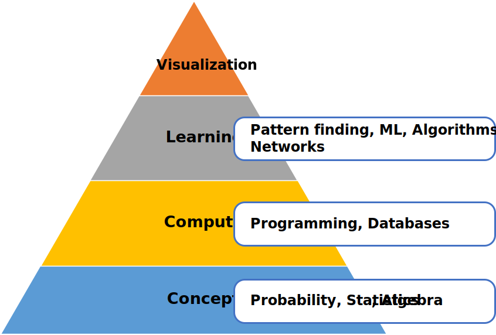
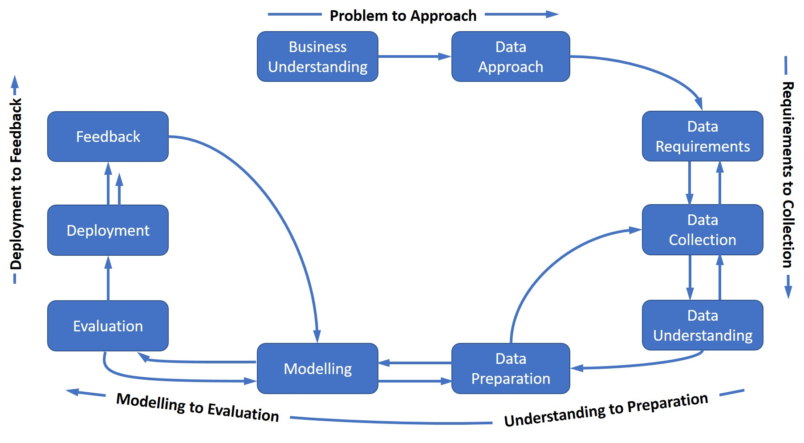
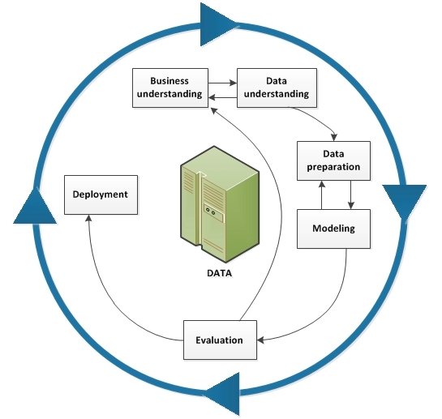

# Definitions
## What is Data Science
- Field of 
    1. Exploring, manipulating, and analyzing data, and
    2. Using data to answer questions / make recommendations / strategic choices
- Data is used to:
    - Understand the world / Environment
    - Validate hypotheses
    - Make choices
    - Uncover previously hidden insights and trends
- Data science includes processes and systems to:
    - Extract structured and unstructured data
    - Transform and manipulate data
    - Use data to generate actionable information and answers
### Layer Model of Data Science Skills

## Data Scientists
- Perform data science activities
- Curious, judgemental, argumentative
- Skills needed:
    - Statistics & Math
    - AI algorithms [R, Python]
    - Large Data storage and manipulation [Hadoop, Spark]
    - Communication / Presentation / Story-telling to empower clients with insights
- Roles:
    - Business Analyst
    - Database Engineer
    - Data Analyst
    - Data Engineer
    - Data Scientist
    - Research Scientist
    - Software engineer
    - Project / Product Manager
    - Statistician

# Applications of Data Science & Opportunities
- From 2013 to 2020, the digital universe will grow by a factor of 10 – from 4.4 trillion GB to 44 trillion GB
- Less than 1% of world data is analyzed.
- Less than 20% of world data is protected
- Emerging markets will supplant the developed world as the main producer of the world's data.
- Data science can be used to discover optimum solutions to existing problems.
## How Big Data is Driving Digital Transformation
- **Digital Transformation**: Affecting business operations - updating existing processes and creating new ones to harness the power of digital technology
- **Digital Change**: Integration of digital change into ALL areas of business, at every level - resulting in fundamental change in operations, employees and value provision to customers. Orgaznizational and cultural change
- Driven by vast amount of digital data and insights derived from it
- Could spread to the entire industry upstream and downstream
- CEO, CDO and CIO need to support and be supported by budgets and priorities as transformation is across levels
## Industry application examples
- Use and correlate data sources like social media, weather, localized events etc.
- Day to day Operations
    - How and when to add surge to get right number of drivers
    - Financial Operations like fraud detection
    - Production planning to maximize utilization and reduce batch wait time
    - Stock Analytics: Inventory / Lead time / Margin Variability
    - GPS Trip analytics - to optimize turnarounds (UPS turn left)
- Social & Public Sector
    - Traffic flow restructure
    - Understand Ferry / Ferrycar usage on public roads
- Customer Interactions
    - Analyze customer complaints data
    - Recommendation engine
    - Answers by personal assistants
    - Ads and recommendations based on online activity & sensor data
- Environmental problems: 
    - Cynaobacterial blooms
    - Predict natural disasters
- Healthcare
    - Find best options for patients by correlating gene markers, environmental factors, existing conditions
    - Improve patient outcomes

## How Should Companies Get Started in Data Science?
- Measure to improve
- Moving towards Data Science
    1. Start capturing & labelling data
    2. Archive old data, do not overwrite
    3. Create and sponsor a data-science team

# Fundamentals of Data Science
## Data Analysis
- Add to knowledge of organization by investigating data and exploring the best way to use it to add value to the businesss 
## Data Mining
- Process of automatically searching and analyzing data, discovering previously unrevealed patterns.
## Data Sources
- Proliferated due to digital technology
- Log files, 
- Email, 
- Social media, 
- Business data (Sales, patient information) 
- Sensor data
- Security Cameras
- etc.
## Computing Power
- Storage
- Processing Power
- Cloud is very helpful in data science
    - Bypass physical limitations of storage and compute
    - Access to heavy duty compute
    - Up to date tools / libraries / software without maintenance overhead
    - Deploy pre-existing, pre created algorithms
    - Sharing of data sets and algorithms across the world
    - Enhances Productivity
## Big Data
- **Definition**: Data that is large enough and has enough volume and velocity that you cannot handle it with traditional database systems.
- Requires new, innovative and scalable technology to collect, host and analytically process to derive real time insights. This is sometimes also included in definition of big data.
- Started by Google. Now used everywhere because of dynamic, large and disparate volumes of data being created by people, tools and machines.
### 5 Vs of big Data
- **Velocity**: Speed of data accumulation
- **Volume**: Scale of Data (data storage). Driven by increase in sources / digital, high resolution sensors (2.5 quintillion bytes everyday on web)
- **Variety**: Structured & Unstructured (80%). Comes from machines (IOT), people and processes
- **Veracity**: Quality of Data & conformity to facts. Deals with Ambiguity, Completeness, Integrity, Consistency
- **Value**: Get benefits from data. Could be social or financial
## Hadoop
- **Concept**: Break data into pieces, replicate the piece across computers. Each computer will run the same program and send results back. Results from all computers redistributed to other processes.
## Deep Learning and Machine Learning
- **Artificial Intelligence**: Everything tech could be considered _artificial_ intelligence. The key idea for AI is to **mimic human behaviour** and not the efficiency of technology
- **Machine Learning**: Subset of AI that uses computer algorithms to analyze large amounts of example data and learns to make intelligent decisions without the learning being explicitly programmed with rule based algorithms
- **Deep Learning**: Subset of ML that uses layered neural networks to simulate human decision making (label, categorize, determine patterns). Learns by feedback loop. Needs large amounts of labeled data to learn. Used for NLP, Images, Audio, Video, time-series forecasting
- **Neural Networks**: Mimics how brain functions. Consists of processing nodes that process and output, which is fed to a second layer of nodes. Similar inputs should provide similar outputs after a lot of similar inputs and "learning". This is computationally expensive.
- **Applied Intelligence**: When AI is used / applied, and data models created towards solving a specific problem
- **Supervised Learning**: Labelled data as input to train model for predictions. Used for regression and classification problems
- **Unsupervised Learning**: Learning with data not labelled. Trying to identify pattern without help of labels. Used for Clustering and Anomaly detection problems
- **Reinforcement Learning**: Based on human learning (Reward for completing desired tasks). Best type of action to take in limited environments in order to maximize reward

# Process of Data Science (or Data Mining)

## Jim Rollins Methodology
- Iterative and never ending cycle

### 1. Business Understanding
- To transition from Problem to Approach
- WHAT PROBLEM ARE YOU TRYING TO SOLVE
- Understand GOAL of the stakeholders (efficiency? market growth?)
- Break goals into objectives and project Requirements. E.g:
    - *GOAL*: "improve quality of care without increasing costs" -->
    - *OBJECTIVE*: "reduce patient readmissions" -->  
    - *REQUIREMENTS*: 
        1. Predicting readmission outcomes for patients with Congestive Heart Failure
        2. Predicting readmission risk 
        3. Correlating events leading to predicted outcomes
        4. Applying process to new patients to assess readmission risk.
- May need some initial data analysis
- Get stakeholder buy-in and support
- Project Sponsor needed to set overall direction, remain engaged, and ensure necessary support as needed

### 2. Analytic Approach
- To transition from Problem to Approach
- HOW TO USE DATA TO SOLVE THIS PROBLEM?
- May depend on problem to solve and who will consume information (e.g. we may need an easy-to-explain model)
- What kind of patterns are needed?
    - **Descriptive**: Relationships between variables. Typically determines existing status. E.g. Clustering
    - **Diagnostic**: Statistical Analysis to determine why things are happening. E.g. Regression, Counts
    - **Predictive**: To determine probabilities of action, or what happens next. E.g. Classification, Decision Tree
    - **Prescriptive**: Get at solutions

### 3. Data Requirements
- Transition from Requirements to Collection
- WHAT DATA IS NEEDED TO SOLVE THE PROBLEM?
- Identify contents, format and data sources for collection
    - Data qualifying conditions and disqualifying conditions to be specified
    - What aspects of data to be covered
    - Format - Record structure (this may need transformations)

### 4. Data Collection
- Transition from Requirements to Collection
- HOW TO GET DATA FOR SOLVING THE PROBLEM
- Assess content, quality and gaps and make substitutions - Data Preprocessing / Wrangling
- Remove redundant data
- Can be done in conjunction with DB admins and data analysts / scientists to make it easier to manage data
- Initial visualizations / stats may be performed
- You CAN defer decisions about unavailable data and attempt to acquire it later

### 5. Data Understanding
- IS THE DATA COLLECTED REPRESENTATIVE OF THE PROBLEM TO SOLVE?
- Perform Exploratory Data Analysis (EDA) to 
    - Summarize main characteristics  of the data
    - Gain better understanding
    - Uncover relationships between variables
    - Extract important variables
    - Find out main variables that impact target features
- Could be done by finding
    - Descriptive Statistics, esp against columns that will become variables in the model
    - [Box Plots](images/boxplot.jpg)
    - Scatter Plots (For continuous variables) to see predictive(x) -vs- target (y) to see correlations 
    - Grouping Data for transformation
    - ANOVA (Analysis of Variance)
    - Correlation between variables / Correlation statistics
        - Heatmaps, Pearson Correlation)
        - Univariate / pairwise correlations / historgrams
            - Helps to remove high correlation variables
            - Help in data preparation decisions
            - Remove outliers
            - Might lead to consolidation of data
            - What does missing value mean for data
- May help to refine data definition and change variable definition

### 6. Data Preparation
- HOW CAN WE MAKE DATA READY FOR USE
- 70-90% of project time. Good candidate for automation
- Transformation of data done here to convert it to model feed
- Includes
    - Cleaning to address missing, invalid and duplicate values
    - Aggregating / Merging
    - Feature Engineering (using domain knowledge)
    - Coding of data (for e.g. text analysis)
    - Splitting data in training and testing data
- May need literary reviews
- May need loopback to data collection stage

#### Deal with Missing values - Possible options
- Check with original data source
- Drop missing values 
    - drop variable if too many missing, 
    - drop data entry if few missing
- Replace missing values (with avg / most common category / replace based on other information)
- Leave missing data as it is

#### Normalization
- Create similar scales of data to 
    - Avoid higher impact of a higher-range value (i.e. if length in range (1500,2500) but width is in range (0, 50), length may unduly influence regression)
    - Make features easier to compare
- Simple feature scaling: `(new_val = old_val/max(val))`
- Min-Max: `(new_val = (old-min(old))/(max(old)-min(old)))` (Values will be 0-1)
- Z-score: `(new_val = (old - mean(old))/stdev(old))` (values between +3 and -3, mostly around 0, normal distribution based)

#### Binning
- Convert values to bins (price to Low/Med/High) to limit impact to data and better representation of feature

#### Categorical variables to quantitative
- **one-hot encoding**:
- 

### 7. Modeling
- HOW CAN WE EXPRESS THE DATA TO GET ANSWERS
- Relate independent variables to dependent variables
- Develop model that are descriptive or predictive
- Descriptive
    - If a person did this, then they are likely to prefer that?
- Predictive
    - Yes / No or Stop / Go answers
    - Uses training set (known outcomes)
- Regression
    - Idea is that noise is a normal distribution
    - Simple Linear Regression (`y = b0 + b1(x)`). `x` is independent variable, `y` is dependent.
    - Multiple Linear Regression is a relation between target `y` and multiple predictors `x1`, `x2`, `x3` ... `xn`
    - Polynomial Regression - for curvilinear relationships between predictor variables and target variables
- Pick the best model (esp right order of polynomial function) to avoid underfitting or overfitting (Minimize the test error, not train error).
- Use cross-validation to select the right alpha (hyperparameter) for ridge-regression. Alpha too high -> Underfitting.
    - Alpha selection process: Train models and calculate R-square for different validation sets and different values of alpha. Pick the alpha that maximizes R-square (GridSearch) on validation sets

### 8. Evaluation
- WAS THE QUESTION ANSWERED?
- Statistical Significance Testing
- Predictive accuracy criteria
    - **Accuracy**: Correct Y and N
    - **Sensitivity**: Proportion of +ve that are correctly identified. True +ve / (True +ve + False -ve)
    - **Specificity**: Proportion of -ve that are correctly identified. True -ve / (True -ve + False +ve)
- There is a tradeoff between Type 1 (False +ve) and Type 2 (False -ve errors) and may require weight adjustment of misclassification cost
- Possible options for **in-sample evaluation**. Insample evaluation tells us how well model fit, but not how well predictions are.
    - **(Visualization)** Residual plot - mean of residuals ~ 0 to indicate linear regressions are correct
    - **(Visualization)** Distribution plot (y against predicted y for same x) and converted to continuous function, esp important for multiple regression
    - **(Numerical Measure)** MSE - noise based on prediction
    - **(Numerical Measure)** R-squared - how close is data to predictor line between 0 and 1. R-square ~ 1 is better
    - Note that MLR / Poly Regression will have smaller MSE but may not necessarily be better fits
- **Out-of-sample evaluation** (Evaluate on unseen data's predictions)
    - **Generalization error** = error between testing data prediction and actuals (**not** train-data predictions and actual)
    - **Cross validation** - Used when you have limited dataset to make training + testing split with sufficient data, difficult 
        - Data sample to be split into k equal groups (folds)
        - Use k-1 folds for training and 1 for testing, repeat till all partitions have been used for trianing and testing. 
        - Use average error for all tests as actual error

### 9. Deployment
- HOW MAKE MODEL / TOOL RELEVANT TO BUSINESS IN REAL LIFE?
- Deployment may require:
    - Training for staff
    - Updating Processes impacted by model deployment
    - Tracking / Monitoring processes

### 10. Feedback
- CHECKS IF MODEL IS STILL RELEVANT
- Makes the process cyclical
- Review process needs to be defined (who, what how, when)
- Metrics to review will need to be defined
-----------------------

## CRISP-DM Methodology
- Cross Industry Process of Data Mining
- [PDF for CRISP manual](https://www.the-modeling-agency.com/crisp-dm.pdf)

### 1. Business Understanding 
- Intention of the project is outlined.
- Requires communication and clarity. 
- Align different objectives, biases, and modalities of relating information from stakeholders
- Goal: Clear perspective of what the project goals are

### 2. Data Understanding 
- Collect data to solve the business question outlined
- Determined by business wants and needs
- Determine: What data is collected, from what sources, and by what methods.

### 3. Data Preparation
- Transform data into a useable subset 
- Check data for questionable, missing, or ambiguous cases. 

### 4. Modeling
- Express data through appropriate models to reveal patterns and structure that provide meaningful insights and new knowledge. 
- Models are selected on a portion of the data and adjustments are made if necessary 

### 5. Model Evaluation 
- Test the selected model using the test-set to run trained model on 
- Determine efficacy of the model and foreshadow its role in deployment

### 6. Deployment
- Use model on new data outside of the scope of the dataset 
- New interactions might reveal the new variables and needs 
- May lead to revision of business needs, model and/or data 

--------------------

## 1. Clarify the Problem / Business Need
- Key question(s) to be answered
- How can you use data to answer the question(s)?
- Costs and benefits of exercise (may be part of goals)
- Expected accuracy of results
## 2. Identify data required to answer the question
- Important - Quality of Data drives output, and may impact cost
- Identify sources of data from Step #2
    - Structured (Tabular, Rows, Columns)
    - Unstructured (Web, maybe video, audio)
- Is the data collected representative of the problem to be solved?
- Identify work needed to manipulate data. May require new data collection initiatives and tools
## 3. Identify Data Strategy & Data Model to use
- Identify the tools to be used
- Data security, safety and privacy requirements
- Will impact Data Storage
## 4. Gather, Clean and Prepare Data
- Remove errors, irrelevant data / attributes
- Ensure integrity checks to avoid human errors
- Formalize dealing with missing information (esp. systematically missing data). You may want to exclude systematically missing data to avoid biases.
- Also called Data Preprocessing / Wrangling
- Includes
    - Missing values
    - Data Format normalization
    - Data normalization (centering/scaling)
    - Data binning
    - Categorical -> Numeric variable conversion
## 5. Transform Data
- Attempt attribute reduction (e.g. Principal Component Analysis)
- Aggregate data if needed
- Transform variable types if needed
- Make changes to data for safety and privacy. 
## 6. Data Mining / Exploration
- Parametric and non-parametric methods
- Machine learning algorithms
- Models for exploration
- Multidimensional views of data
- Identify patterns, archetypes and outliers
- May cause change in approach
## 7. Communicate Results & Recommended actions
- Test predictive capabilities for efficiency and effectiveness
- Share for feedback
- Add Visualizations

## Enterprise Data Management
- Gearing of People, Process, Technology Stack towards solving the problem of managing increasing amount of data for efficient use in data science.
- Key aspects to consider:
    - Data governance
    - Data Storage - Lakes, connections etc. 
    - Data Pipelines / Data Supply chain 
    - Technology: Storage, data governance, modernize platforms
    - Use of Data
        - Visualization
        - Machine Learning
        - Regular BI already existing

# The Data Analysis Report
- Small Reports for key findings
- Detailed Reports build on arguments, provide details about relevant work and methodology, data sources, and perform a critical review of subject matter

## Report Format
- **Coverpage**: Title, Authors, Contacts, Insitute name, Date
- **Table of Contents**: 
    - Map of the journey the report will take you on
    - Offer a glimpse of what is ahead
- **Executive Summary**: Abstract of the report. Explain crux of your work / argument. 3-4 paragraphs (10-15% of report length)
- **Report Introduction**: Setup the problem, and review available relevant research / literature
- **Methodology**: Research methods and data sources used
- **Results**
    - Descriptive Statistics first
    - Illustrative Graphics
    - Hypotheses testing (Regression, cateogorical analysis)
- **Discussion**: Craft arguments for your conclusion
- **Conclusion**: Generalize findings and promote, future directions
- **Acknowledgements & References**
- **Appendix**

## Report Checklist
1. Have you told readers, at the outset what they might gain by reading this report?
2. Have you made the aim of your work clear/
3. Have you explained the significance of your contribution?
4. Have you set your work in the appropriate context by giving sufficient background (and references to your work)?
5. Have you addressed the question of practicality and usefulness?
6. Have you identified future developments that might result from your work?
7. Have you structured your paper in clear and logical fashion?

# Data Science Tools
- Depends on needs, problems you are solving, who you are solving them for
- Company you work for, needs, age of application
## Languages
- Top 3: Python, R, SQL
### Python
- 75% of data science professionals use and are needed in biz
- For Data Science
    - Scientific computing: Pandas, NumPy, SciPy, Matplotlib
    - AI: PyTorch, TensorFlow, Keras, Scikit-learn
    - NLP: NLTK
### R Programming Language
- Free Software (not Open Source)
- Used by Statisticians, Mathematicians and data miners
- Array oriented syntax to easily go from math to code
- Large repository of statistical knowledge
- 15000 publicly released packages
- Integrates with C++, C, Javan, and Python
- Stronger OOP than other statistical computing languages
### SQL
- **S**tructured **Q**uery **L**anguage
- Non procedural language
- Scope limited to querying and managing data.
- Useful to handle structural data in Relational Databases
- Interpreter between user and database
- ANSI standard - across DBs (mostly)
### Other Languages
- Scala, Java, C++, Julia
- JS, PhP, GO, Ruby, Visual Basic
- JAVA: 
    - OOP, Widely adopted in ML
    - Weka (data mining), JavaML (ml library), Apache MLib, Deeplearning4J
    - Hadoop is java based
- Scala:
    - Functional programming language
    - Interoperable with Java
    - Apache Spark! for big-data processing (Shark, Mlib, Spark Streaming)
- C++:
    - Last mile / high performance even when Python is used for initial stuff
    - MongoDB, Caffe (deep learning)
- JavaScript:
    - TensorFlow.js (browser and nodejs), brain.js, machinelearn.js, R-js (R to Typescript port)
- Julia:
    - Speed of C + ease of Python
    - Refined parallelism, calls other languages
    - JuliaDB
## Data Management
- Process of persisting and retrieving data. Tools:
### Open Source Tools
- RDS: MySQL, PostgreSQL
- NOSQL: CouchDB, MongoDB, Cassandra
- File based tools: Hadoop HDFS, CEPH (cloud file system)
- Elastic search: Search index for fast document retrieval
### Commercial Tools
- RDS: Oracle, SQL Server, IBM DB2
### Cloud Tools
- SaaS versions of all OS and Commercial tools for most vendors
- NoSQL: Amazon DynamoDB, Cloudant (based on CouchDB)
- IBMDB2 Cloud

## Data Integration and Transformation
- ETL. Process of retrieving, transforming and loading it into a local data management system. Aka ELT, or Data Refining/cleaning
### Open Source Tools
- Apache Airflow
- Kubeflow - pipelines on top of Kubernetes
- Apache Kafka
- Apache Nifi - visual editor
- Apache Sparks SQL - ANSI sql in scaled up compute clusters
- NodeRED - Visual editor
### Commercial Tools
- Informatica
- IBM Infosphere DataStage
- Talend
- IBM Watson Studio Desktop
### Cloud Tools
- IBM data Refinery
- Informatica Cloud Data Integration

## Data Visualization
- Part of initial data exploration and final deliverable
### Open Source Tools
- Hue - visualization from SQL
- Kibana - for ElasticSearch
- Apache SuperSet - webapp for visualization
### Commercial Tools
- Tableau
- IBM Cognos Analytics
- MS PowerBI
### Cloud Tools
- Datameer
- IBM Cognos Analytics
- IBM Data Refinery in Watson Studio

## Model Building
- Process of creating a ML or deep learning model using an appropriate algorithm with lot of data input
### Commercial Tools
- SPSS Modeller
- SAS Miner
### Cloud Tools
- Watson Machine Learning
- Google AI Platform training

## Model Deployment
- Makes a trained ML model available for use to other applications for consumption
### Open Source Tools
- Apache PredictionIO: Spark ML model deployment
- Seldon: Supports all frameworks (R, SparkML, TensorFlow). Runs on OpenShift and Kubernetes
- TensorFlow service: for Tensorflow. TensorFlow lite is also there, as is Tensorflow.js
- MLeap: SparkML models
### Commercial Tools
- SPSS Modeller. Deeply integrated in Building tools
### Cloud Tools
- IBM Watson Machine Learning

## Model Monitoring and Assessment
- Ensures performance and quality check on deployed models. Accuracy and bias check, as well as adversarial attack check.
### Open Source Tools
- ModelDB: Machine model metadatabase. Natively supports SparkML, Scikit-learn
- Prometheus
- IBM AI Fairness 360
- IBM Adverserial Robustness 360
- IBM AI Explainability 360 Toolkit
### Cloud Tools
- Amazon SageMaker
- Watson OpenScale
- Other cloud providers also have their version

## Code Asset Management
- Versioning and other tools for collaborative teamwork
### Open Source Tools
- Git is standard. Github supports Git, Gitlab is runner-up and is OSS. Bitbucket is an option

## Data Asset Management
- Replication, backup, access rights management on data (versioning, annotation)
### Open Source Tools
- Apache Atlas
- ODPi Egeria
- Kylo: OS datalake management software platform
### Commercial Tools
- IBM Infosphere Information Governance (Data Dictionary)
- Informatica: Enterprise Data Governance

## IDE (Integrated Development Environment)
- Help developers / data  scientists to implement, execute, test and deploy work
### Open Source Tools
- Jupyter: Interactive python programming (others supported through kernels). Unifies documentation, code, outputs and visualizations in a single document.
- JupyterLab: NextGen of Jupyter. To replace Jupyter
- Apache Zeppelin: Inspired by Jupyter. Integrated plotting, unlike Jupyter
- R Studio: One of the oldest. More for R. Python is possible.
- Spyder: R Studio for Python
### Commercial Tools
- Watson Studio / Watson Studio Desktop with Watson OpenScale
- H2O.ai Driverless
## Execution Environment
- Areas where preprocessing, model training, deployment occurs
### Open Source Tools
- Apache Spark: Cluster Execution environment. Linearly scalable. Batch data processor
- Apache Flink: Stream processor, as opposed to Spark.
- Riselab RAY: Large-scale deep learning model training
### Commercial Tools

## Fully Integrated Visual Tools
### Open Source Tools
- KNIME: Can be extended by python, connects to spark
- Orange: Less flexible than Knime but easier to use
### Cloud Based Tools
- Watson Studio + Watson Openscale
- MS Azure Machine Learning
- H2O Driverless AI: Oneclick deployment for common providers. Not PaaS or SaaS however.

## Data Science Libraries
### Scientific Computing Libraries
- Pandas: Python. Data Structure and Tools (Dataframes)
- NumPy: Python. Based on Arrays and can apply math functions. Base for Pandas
### Visualization Libraries
- Matplotlib: Python.
- Seaborn: Python. Based on Matplotlib. Heatmaps, timeseries, Violin plots.
### High Level Machine Learning and Deep Learning
- Scikit Learn: ML. Python. Tools for regression, classification, clustering
- Statsmodels: explore data, estimate statistical models, perform statistical tests
- Keras: Python. Deep learning models
- TensorFlow: Python. Low level framework in deep learning models
- Pytorch: Used for experimentation
### Database Libraries
- psycopg2 (PostgreSQL)
- ibm_db (Db2) 
- pymongo (MongoDB)
- SQLAlchemy (ORM)
### Non Python
- Apache Spark: General purpose cluster computing framework. Similar functionality as pandas, numpy
- Vegas: Spark data frames can be used. Visualization
- Big DL: Spark based Deep learning
- R-Libraries
    - ggplot2: For visualization
    - Keras and Tensorflow also avalable

## Data Sets
- Collection of data (text, numbers, media etc)
- Could be:
    - Tabular (e.g. csv) in rows / columns
    - Hierarchical (e.g. tree)
    - Network (e.g Graph)
    - Raw / Image data (like MNIST)
- Sources
    - [Open Knowledge Foundation](datacatalogs.org)
    - UN / EU / Governmental databases
    - Kaggle
    - [DAX - Data Asset eXchange](https://developer.ibm.com/exchanges/data/) for enterprise data from IBM research and 3rd party - created by IBM
    - [Chicago City Data](https://data.cityofchicago.org/)
    - [Geonames - Geographical Data Repository](https://www.geonames.org/)
    - [Data Hub](https://datahub.io/)
    - [Open Data Soft Public Hub](https://public.opendatasoft.com/explore/?sort=modified)
- Licenses
    - Community Data Licensing Agreement (CDLA)
    - **CDLA-Shared**: Permission to use and modify data (under CDLA-S)
    - **CDLA-Permissive**: Permission to use and modify, but modifications are not required to e CDLA-S

## ML Models
- Repositories
    - [IBM Model Asset Exchange](https://developer.ibm.com/exchanges/models/)
    - FOSS for ready-to-use deep learning microservices
    - Microservice components
        - Data + Model (Pre-trained) + Compute

# References
- [PDF for CRISP manual](https://www.the-modeling-agency.com/crisp-dm.pdf)
- [Sensitivity vs Specificity](https://en.wikipedia.org/wiki/Sensitivity_and_specificity)
