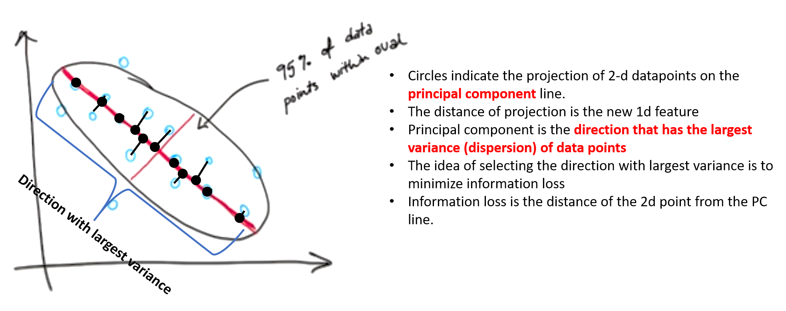
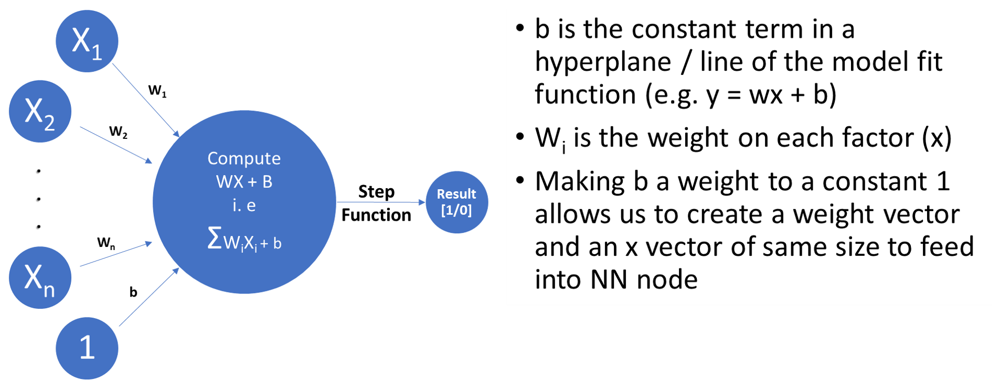

# Definitions

- **Artificial Intelligence**: AI is the broad capability of machines to perform activities using human-like intelligence.The key idea for AI is to **mimic human behaviour** and not the efficiency of technology.
- **Machine Learning**: Subset of AI that uses computer algorithms and **statistics** to analyze large amounts of example data and learns to make intelligent decisions without the learning being explicitly programmed with rule based algorithms.
- **Deep Learning**: Subset of ML that uses layered neural networks to simulate human decision making (label, categorize, determine patterns). Learns by feedback loop. Needs large amounts of labeled data to learn. Used for NLP, Images, Audio, Video, time-series forecasting
- **Neural Networks**: Mimics how brain functions. Consists of processing nodes that process and output, which is fed to a second layer of nodes. Similar inputs should provide similar outputs after a lot of similar inputs and "learning". This is computationally expensive.
- **Applied Intelligence**: When AI is used / applied, and data models created towards solving a specific problem
- **Supervised Learning**: Labelled data as input to train model for predictions. Used for regression and classification problems. Easier to evaluate and in controlled environment
- **Unsupervised Learning**: Learning with data not labelled. Trying to identify pattern without help of labels. Used for Clustering and Anomaly detection problems. Harder to evaluate and less controlled environment
- **Clustering**: Unsupervised learning task that helps to determine if there are any naturally occurring groupings in the data.
- **Categorical data**: means where data falls in one of a finite, discrete set of values / categories
- **Continuous data**: does not fall in a finite set of discrete classes. The data label may possibly take an unlimited number of values.
- **Label**: refers to an indicator / solution for the data which can be used to train the model
- **Reinforcement Learning**: Based on human learning (Reward for completing desired tasks). Best type of action to take in limited environments in order to maximize reward
- **Features**: Aspects of the data which will be used to describe / analyze the data
- **Machine Learning Model**: Block of code / framework that can be modified by the data used to train it, to solve different but related problems based on data provided. E.g. Linear Regression is a model
- **Model Training Algorithm**: Shapes the model by using the data - adjusting the model parameters iteratively to fit the data provided to move towards the goal (labels) of the data.
- **Cost Function of a Model**: 

# Process of Machine Learning
- 
- 
- 
- ML pipeline is the sequence of events to be done to deploy a machine learning model

## 1. Feature Extraction / Data Preprocessing

### Feature Selection
- Aim: Select features that completely encapsulate the trends / patterns in your data
- Aim2: Have the # of features that balance between bias and variance
- Remove stuff that doesn't help you
- Features and information may not be one and the same. We want information from the data, not a lot of features.

#### Latent Vs Measurable Features
- Measurable features may be a proxy for latent features (that drive your decisions) that you might be measuring. 
- It may be a good idea to go a level below your features to see what latent features you're aiming to "measure" for your ML algorithm, and see if there are better measurable features than one you've picked.
- E.g. While a regression for price of house may meaure "square footage", "number of rooms", "school rangking", "neighborhood safety", essentially, the latent features in question are size of house, and neighborhood of the house.

#### Feature Addition
- Add features / computed features that add to describing data patterns
- Process to add features
    1. Use human intuition to find features that might encapsulate data that can be exploited using machine learning
    2. Code up the feature
    3. Visualize the feature to find if the feature has discriminating pattern
    4. Repeat the process based on findings and what we learned about the data 

#### Feature Removal
- Feature removal might be needed to avoid unnecessary computation.
- Feature Removal may be useful for features that:
    - are noisy
    - cause overfitting for the model
    - are highly correlated to another feature that is present
    - slow down the training / testing process without adding too much to accuracy of prediction

#### Feature Selection in `sklearn`
- Most methods are for univariate feature selection: The idea is to identify how much power each feature independently gives you in classification / regression
- `sklearn.feature_selection.SelectPercentile` selects X% of features that are most powerful
- `sklearn.feature_selection.SelectKBest` selects K features that are most powerful

#### Regularization
- Refers to mathematically defining the error function, to select # of features that maximizes the quality of model. Easier to do in some models.
- E.g. Lasso Regression aims to minimize Sum of Squared Errors AS WELL AS minimizing coefficients of regression (by minimizing `SSE + lambda*beta`) where 
    - **Beta** - Coefficients of regression
    - **lambda** - Coefficient penalty - you may want to penalize large coefficients more or less.
- Lasso Regression present in `sklearn.linear_model.Lasso()`
- Types of Regularization
    - **L1**: Good for feature selection. Sparse vectors for weights. Uses absolute values of coefficients of regressions
    - **L2**: Better for training models. Not sparse vectors. Uses squares of coefficients of regressions

### Principal Component Analysis (PCA)
- Technique for reducing the dimensionality of datasets to increase interpretability while minimizing information loss. 
- Done by creating new uncorrelated variables that successively maximize variance. Helps to compress feature sets
- PCA finds a new coordinate system for a given set of data points by translation and rotation:
    1. Moving centre of coordinate system at the centre of the data
    2. Moving the X-axis to the principal axis of variation
    3. Other axes are moved in orthogonal axis to axis of variation
    4. Tells you how important the non-principal axes are
- Also a standalone method for unsupervised learning
- PCA will find independent principal components. So there's no overlap between PCs
- **Applications**:
    - Find latent features driving patterns in data
    - Dimensionality Reduction can help with
        - Visualize high-dimension data
        - Reduction of noise by finding main drivers of patterns
        - Reduce inputs for other algorithms (avoid variance / increase speed of training) .. example is facial recognition

#### PCA for Dimension Reduction
1. Find the principal component for the vector (direction). Principal component of a dataset is the direction that has the largest variance (statistical variance) of data points. See figure.

2. Find projection of data points on the direction vector. This projection is now a one-dimensional feature.

#### PCA in `sklearn`
- `sklearn.decomposition.PCA` has the object that does PCA
- `PCA.fit()` will perform the PCA
- `PCA.explained_variance_ratio_` is where eigen values live for principal components
- `PCA.components_` is a list of principal components
- **Important Parameters**
    - `n_components` gives the number of principal components to find in data.

### Feature Scaling
- Important when using / comparing features that are different scales (different units e.g. height + weight) to avoid the result being dominated by the feature whose absolute values are larger (e.g. weight)
- Scaling means you re-state the feature measurements to span comparable ranges without losing informational differences. So height and weight can both be between 0 and 1. This way, each feature has a similar weightage.
- Scaling formula is `x_scaled = (x-x_min) / (x_max - x_min)`
- Note that if the features have all the same value, min and max will be same, which means the formula will break. It is easier to assign a singular value to all features in this case (0.5, or 1)
- **CAUTION**: Outliers may unduly influence the denominator and therefore scaled values.
- Will affect most algorithms where X and Y coordinates are traded-off (euclidean distance maximization algorithms like SVM and K-means)

#### Feature Scaling using `sklearn`
- `sklearn.preprocessing.MinMaxScaler` helps to scale feature to a range
    - `MinMaxScalar.fit_transform(numpy_array)` will return an array of re-scaled feature-set. 
    - The `numpy_array` provided as input has to be `float`.

### Types of Data
- Numerical - Continuous number field (e.g. Salary)
- Categorial - Limited number of discrete values (e.g. Job Title)
- Time Series - Temporal value (date, timestamp) (e.g. mail time-stamp)
    - Time series data is a special case of temporal data. Time series is a series of data points indexed / listed / graphed in time order, and typically taken at successive equally spaced time intervals.
- Text Data - Words (e.g. email text)
- Text data might be easily turned to numbers for easy computation.
- Be very careful about introducing features that come from different sources! It’s a classic way to accidentally introduce biases and mistakes.

- Data can also be continuous or discrete (categorical / unordered). This will also impact algorithm used for training the model.

### Outliers
- Observations that lie an abnormal distance from other values in a random sample
- Caused by:
    - Sensor malfunction
    - Data Entry Errors
    - Freak Events

#### Detection of Outliers
- Find points in training set with highest residual error (post training)
- Remove these points (about 10% with highest residual errors) and retrain

### Text Processing - Bag of Words
- Used to create a vector containing the frequency of occurences of words in a given text sample.
- **Stems** of the words are typically considered (loves and love are the same word). Stemming is done before Bag of Words are created.
- Stop words (A, The, etc) are removed. These are typically low information and hig frequency words.
- Complex phrases are hard. "Chicago Bulls" is different semantically from "Chicago" and "Bulls". But BoW will not handle that.

#### Implementing Bag of Words in `sklearn`.
- `sklearn.feature_extraction.text.CountVectorizer()` is used to create vectors out of text.
- Produces a sparse representation of the counts using `scipy.sparse.csr_matrix`.
- `vectorizer.fit_transform([list of sentences])` do the work of counting the words and putting counts of each word against it.
- `vectorizer.fit()` creates the vocabulary dictionary
- `vectorizer.transform()` creates the document-term matrix
- `vectorizer.get_feature_names()` will give a list of all unique words.
- `vectorizer.vocabulary_.get(<word>)` gives the index of the `<word>` in bag of words.

### Text Processing - TF-IDF Representation
- **T**erm **F**requency - **I**nverse **D**ocument **F**requency
    - **TF**: Each term (word) is up-weighted by how often it occurs in the document
    - **IDF**: Each term (word) is weighted (inversely) by "how often" it occurs in corpus (not just the document) as a whole. This helps to give a higher weight to "rare" words than words that occur frequently in all documents.

#### Implementing tf-idf in `sklearn`
- Can be done using `TfidfVectorizer` and using `fit_transform`
- Parameters
    - `max_df`
    - `stop_words`

### Text Processing - `nltk` package
- Stands for `Natural Lanaguage Tool Kit`. Has utilities to help with language processing
- Download corpus using `nltk.download()`
- **Stopwords** 
    - Get stopwords from nltk, `sw = nltk.corpus.stopwords.words("<language>")` (for english, it is "english")
- **Snowball Stemmer**
    - Present as `nltk.stem.snowball.SnowballStemmer("<language>")`
    - `stemmer.stem(<"token">)` will return the stem in language with which it was initialized.

### One-Hot Encoding
- Used to convert categorical data into numbers
- The idea of using a single variable with different number values denoting classes has the problem that it may lead to "assumption" of relationships between classes.
- One-Hot Encoding alleviates this by creating **as many new variables as there are classes**. For each datapoint, the variable corresponding to the datapoint's class will have value 1, all other class-variables will have value 0

### Softmax
- Aka normalized exponential function is used to normalize the output of a network to a **probability distribution** over predicted output classes.
- Converts numbers in a set(including negatives) to probabilities between 0 and 1, and all numbers will add up to 1
- Softmax(zi) = e^zi/(Sum of e^zj for all z's in the list)
- Also works if scores are negative
- Is continuous and differentiable
- Better used when scores being softmaxed are > 1

## 2. Model Definition / Algorithm Setup
- Type of data will often determine the algorithm used for classification / prediction.
- Machine learning can be supervised and unsupervised
    - **Supervised Learning** Techniques recognize patterns in labeled ("correct") data to then apply them on new unlabeled data. 
        - E.g Regression, Classification
    - **Unsupervised Learning** refers to the process of finding a structure in data that is not labeled (and typically of the same class)
        - E.g. Clustering, Sequence Mining, Recommender Systems etc.

### Train Test Split 
- Size of the data matters when training. More training data means higher accuracy usually. However, marginal gains achieved by increasing training data-set size reduce as size increases.
- More data > Fine-tuned algorithm
- Question to ask:
    - Do I have enough data to train an effective ML model

#### Test Train Split using `sklearn`
- Generally under `model_selection`
- `sklearn.model_selection.train_test_split()` will
    - Input: Data, Target, size of test, random_state
    - Output: Training data, Testing data, Train Labels, Test Labels

### Tuning the Model
- With all models, there's an element of repeat experiments with hyper-parameter tuning to find the one that is most predictive.
- `GridSearchCV` is one way of systematically working through multiple combinations of parameter tuning, cross-validating along the way to determine which parameters provide the best performance.

#### GridSearchCV working (`sklearn`)
1. Create the dictionary of parameters we want to search over
2. Instantiate the algorithm object
3. Perform the grid search on the algorthim with parameters, to find the algorithm with best parameter results
4. Fit using the found algorithm

    ```python
    parameters = {'kernel': ('linear', 'rbf')}, 'C':[1, 10]}
    svc - svm.SVC()
    clf = grid_search.GridSearchCV(svc, parameters)
    clf.fit(data, target)
    ```
- `clf.best_params_` will contain the best parameter values after `GridSearch`

## 3. Model Training 


## 4. Model Testing

## 5. Model Evaluation
- Evaluation is necessary because:
    - It gives an estimate of performance on an independent data set
    - It serves as a check on overfitting
- Generally this means comparing predicted feature values to actual feature values in a test-set previously unseen by the trained model. 

### Model Accuracy
- `(number of data points labeled correctly) / (total number of data points)`
- Accuracy shortcomings
    - Not ideal for skewed classes. Guessing the most common answer will give good accuracy.
    - May not be tailored to a err towards a particular prediction (innocent / guilty)

### Model Error
- Error is typically based on each prediction, and is `actual value - predicted value`.
- A good model will minimize error across all points

### Confusion Matrix
- 2x2 matrix that acts as a comparison of actual class vs predicted class. True and False labels are based on prediction.
- 
    - A **False Negative** is when the prediction is "not in class" but the data is actually in class.
    - A **False Positive** is when prediction is "in class" but data is not in class
- **IMPORTANT TERMS**:
    - **Recall**: How well is your prediction matching reality. I.e, how much of the truth can your model recall. Aka how much of actual value matches with prediction. Calculated as `True Positive / (True Positive + False Negative)`. Officially, probability that a class data point is correctly predicted as belonging to that class.
    - **Precision**: How correct is your prediction, i.e. proportion of your prediction of a certain class that is correct. Calculated as `True Positive / (True Positive + False Positive)`. Officially: Probability that a predicted data point actually lies in the class.

### BIAS VARIANCE
- **Bias**: A high bias ML algorithm is one that practically ignores the data i.e. doesn't learn, and will not take data into account to make prediction. High bias means high error on training set (low r2). Bias means your model hasn't described the data fully.
- **Variance**: A high variance is extreme perception to data. That is overfitting, and will not generalize to new stuff. High variance has high error on test set. High variance means your model is over-indexing on what it can learn from the data.
- Bias / Variance trade-off is common in ML training

### Cross Validation
- Is used to maximize test set and training set for best learning, given the constraint of splitting data into independent test and train set.
- Done by
    - Separating the data into K bins
    - Pick one of the K bins as test set and rest of the data as training set
    - Calculate accurancy on test set
    - Repeat the experiment for each of the k bins
    - Average the accuracy across k accuracies to get a better picture of model performance

#### K-Fold Cross Validation in `sklearn`
- `sklearn.cross_validation.KFold` is object for KFold Cross Validation
- `KFold(<number_of_items_in_dataset>, <how_many_folds>, shuffle=True)`
- `kf` object will give you indices for training and testing dataset that you can use to separate train and test data
- If `shuffle=True` is not added, KFold splits data in order, so if your data is not random, bins will be skewed.
- `StratifiedKFold` assigns data points to folds so that each fold has approximately the same of data points in each output class. This can be used to counter class imbalance (one class has a lot of data, other classes don't).

## 6. Model Deployment / Prediction


# Supervised Learning Techniques
- Recognize patterns in labeled ("correct") data to then apply them on new unlabeled data

## Regression / Estimation
- Used to predict continuous values of a dependent variable based on independent variables / characteristics
- Independent variables are explanatory variables: Denoted by x. Can be categorical or continuous.
- Dependent variable is "y". **Must be continuous**
- Regression is to find a best-fit line (not a decision boundary) y = f(x<sub>i</sub>).
- Regression can be 
    - Linear or non-linear
    - Simple (one independent var) or Multi-variate (multiple independent vars).
- **Applications**
    - Sales forecast
    - Satisfaction analysis
    - Price estimation
    - Employment income

### Regression Algorithms
- Ordinal Regression
- Poisson Regression
- Fast Forest Quantile Regression
- Linear, Polynomial, Lasso, Stepwise, Ridge Regression
- Bayesian Linear Regression
- Neural Network Regression
- Decision Forest Regression
- Boosted decision tree Regression
- KNN (K-nearest neighbors)

### Regression Evaluation
- A good regression will minimize the total error (`actual value - predicted value`) across all points (without worrying about the sign, to avoid cancelling out of large errors on both sides of the regression).
- Testing accuracy should be done on a "test-set" to avoid testing on data model has already seen while training. Testing and training sets should be mutually exclusive
- K-fold cross validation can be performed to reduce bias due to unfair split of test and train data: 
    - Break the full dataset into K folds. 
    - Use 1 fold for testing/evaluation and remaining k-1 folds for training. Repeat this for each fold.
    - Accuracy of model is average of accuracy of testing with each individual fold.

#### Metrics for Regression Evaluation
- Mean Absolute Error
- Mean Square Error 
    - Minimizing this is preferred over MAE.
    - This is for math purposes. 
    - Typically assumes that errors are "normally" distributed.
    - Squared errors finds the most "centrally fit" line, which MAE minimization may not find.
- Root Mean Square Error
- Relative Absolute Error (Normalized MAE)
- Relative Square Error (Normalized MSE)
    - Determines how much of my change in output is explained by change in input.
    - R<sup>2</sup> = 1 - RSE. Higher R<sup>2</sup> is better
    - Preferrd of MSE because it as data-points increase, MSE increases but RSE will not.

### Non Linear Regression
- Models a non-linear relationship between dependent variable and indenpendent variable(s)
- y<sup>hat</sup> must be a NON-LINEAR function of the PARAMETERS, NOT NECESSARILY THE INDEPENDENT VARIABLES
- Will not use Least Square Error
- **By contrast, a polynomial regression (powers of x and not powers of parameters (theta) can use Least-squares-error**

### Coding Regression in `sklearn`

#### Linear Regression
- Linear Regression is present in `sklearn.linear_model.LinearRegression` object
- `reg.coef_` will have the value of coefficient
- `reg.intercept_` will have value of coefficient
- `reg.predict([list, of, values])` expects a list of values for prediction. Even if you have one value.
- `reg.score()` will give the R<sup>2</sup> score


## Classification
- Supervised Learning
- Classify items into discrete class or category of a case (churn, tumor malignancy)
- Target variable is a categorical variable with discreet values
- Typically algorithms are trying to find decision boundaries

### Decision Trees Classification
- Structure
    - Internal Node: Test a category
    - Branch: Resulting test path 
    - Leaf Node: Classification
- Based on recursive partitioning
- Pros:
    - Easy to use
    - Can build big classifers (ensemble methods). Ensemble methods are meta classifiers built from many decision trees (adaboost, random forest)
- Cons:
    - Prone to overfitting. Need proper parameter tuning
- **Ensemble Methods:**
    - Ensemble methods are meta-algorithms: creating a composite model which combines a series of classifiers to create a strong classifier.
    - Individual classifiers vote and majority voting combined according to specific criteria determines final prediction label.
    - Criteria could be based on specific aims, for e.g:
        - **Bagging** - to decrease variance. E.g Random Forest
        - **Boosting** - to decrease bias. E.g. Adaboost
        - **Stacking** - to improve model predictions.

#### Decision Tree Algorithm
- Recursively find the attributes that return the highest information gain (lower entropy). Entropy is a measure of impurity in a bunch of examples.
1. Choose attribute from the data set
2. Calculate significance of attribute in splitting data
    - High significance -> High purity (aka low entropy) of predicted variable. So, **most** of a particular value of target variable is accounted for by the attribute in one branch
3. Split data on value of the best attribute
4. Repeat for all attributes
- ID3(Iterative Dichotomiser 3), C4.5, C5.0 and CART are common Decision Tree algorithms.

#### Coding Decision Trees in `sklearn`
- **Important Parameters**:
    - `criterion`: could be `gini` (default) or `entropy` (based on information gain)
    - `min_samples_split`: default value is 2. Governs the depth of the tree. Determines how many samples present in a node before we stop splitting the node further. Small value may lead to overfitting.

### Adaboost
- Is a sequential ensemble method.
- Basic concept is to set the weights of classifiers, with each training iteration to improve prediction accuracy.
- Advantages
    - Easy to implement.
    - Improves accuracy by combining weak learners.
    - Can be used with multiple classifiers
    - Not prone to overfitting
- Disadvantages
    - Sensitive to noise 
    - Affected by outliers because it tries to fit each point perfectly.
    - AdaBoost is slower as model cannot be parallelized.

#### Adaboost Algorithm

1. Train the first classifier (e.g. Decision Tree) on subset of data normally
2. Predict the whole dataset based on model trained.
3. Calculate errors by comparing predictions and actual values.
4. Provide higher weight to data points predicted incorrectly. Weights are given in proportion to the error observed.
4. Train the second classifier based on updated weights.
5. Repeat the process till error-function stops changing, or for a set number of iterations

#### Coding Adaboost in `sklearn`
- **Important Parameters**
    - **`base_estimator`** is the learning algorithm to use to train the  models. Typically `decision tree` (default argument).
    - **`n_estimators`** are the number of models to train iteratively (# of iterations effectively). Default 50.
    - **`learning_rate`** is contribution of each model to the weights. Defaults to 1. Reducing learning rate will mean the weight-change occurs slowly, model will train slower
    - `loss` sets the loss function to use when updating weights. Default linear, but can be square or exponential.

### Random Forest
- Is an ensemble-based meta algorithm
- Advantages
    - Considered accurate and robust as it uses large number of decision-trees to make predictions.
    - Reduces biases because of multiple votes. Does not suffer from overfitting
    - Can handle the missing values (by using median values or weighted averages).
- Disadvantages
    - High computational complexity. Slow predictor, due to number of decision trees..
    - Difficult to interpret as compared to a decision-tree

#### Random Forest Algorithm
1. Randomly select k features from a total of m features where k < m.
2. Create a decision tree based on these k features.
3. Build the forest by repeating steps 1 and 2 n times to create n number of trees.
4. Predict the test-set using all the n models.
5. Calculate the votes for each predicted target. Consider the high voted predicted target as the final prediction.

#### Coding Random Forest in `sklearn`
**Important Parameters**
    - `n_estimators`: Default=100. The number of trees in the forest.
    - `max_depth`: Default=None. If None, then nodes are expanded until all leaves are pure / contain less than `min_samples_split` samples.
    - `max_features`: Size of the random subsets of features to consider when splitting a node. Lower `max_features` will reduce variance, but increase bias. Empirical good default values are `max_features="sqrt"` (random subset of size sqrt(n_features)) for classification tasks

### Naive Bayes

### Linear Discriminant Analysis

### k-Nearest Neighbor
- Intuitive idea that neighbors are similar. Distance between two cases is a measure of their dissimilarity

#### KNN Algorithm
1. Pick a value of K
2. Calculate distance of unknown case from all cases
3. Select K observations in the training data that are nearest to unknown data point
4. Unknown data-point will be in same class as most populare response value from K nearest neighbors
5. Repeat for many values of K to find best value of K for a test set.

#### Important points
- Normalization of features is necessary to calculate distance to avoid being biased by a particular feature
- A proper value of K (too small: overfitting, too large: over-generalization)

### Logistic Regression
- Analogous to linear regression for **binary** and sometimes multi-class classification of categorical dependent
- Good to use for:
    - Binary data
    - Probabilistic score (betweek 0-1)
    - Linear decision boundary needed 
    - Feature selection / understanding impact of independent variables (based on statistical significance)
- Uses a sigmoid function on the predicted Y-hat from linear regression to give a probability between 0 and 1
- Probability indicated as P(Y=1|X) (Probability of Y being in class 1 given X)

#### Logistic Regression Algorithm
1. Initialize Theta (values of feature vector) with random values
2. Calculate model output (y-hat) = sigmoid(theta-transpose * X)
3. Compare Y-hat with actual Y values to record total error (Cost function of the model - e.g. MSE)
4. Change Theta to reduce the cost function (gradient descent)
5. Repeat till cost function is low (accuracy is satisfactory)

#### Important Points
- Dependent variable has to be binary usually
- Independent variables need to be continuous (i.e. numerical)

### Support Vector Machines
- Supervised alogrithm that classifies by finding a separator (a hyperplane / curve) for a linearly non-separable data-set. Typically data of two classes.
- Prone to overfitting
- Not efficient for large datasets (> 1000 rows) - large training time.
- Naive Bayes might be better for noisy dataset
- Used for
    - Text category assignment
    - Image recognition
    - Sentiment analysis
    - Spam detection
    - Gene Expression classification
    - Regression, outlier detection and clustering

#### SVM Algorithm
- Find the hyperplane that has max distance (aka margin) to support vectors
- The idea is to find a hyperplane that maximises the margin (aka distance) between the hyperplane and the nearest points for classes on **both** sides
- SVMs first makes sure classification is correct, and THEN maximizes margin. Outliers are ignored based on parameters.

#### Important points
- Needs data transformation to create linearly separable data. This is called Kernelling
- Kernelling means using a function that take a low dimension feature space (non-linear) and map it to a high-dimension space (linear and separable). So, for example, you transformation from a "circular boundary" to a "linear boundary".
- The high-dimension linear space can be SVM'ed and the points you get are separated in low-dimension space.
- Kernelling functions
    - Linear
    - Polynomial
    - RBF
    - Sigmoid

#### Coding SVM in `sklearn`
**Important Parameters**
- Arguments passed when you create the classifier (before fitting) that affect the output (decision boundary)
    - Kernel Function (See above)
    - **C or Regularization Parameter** - Tradeoff between smooth decision boundary and classification accuracy. Overfitting is controlled here. Large C will mean a convoluted boundary as it favours correctly classifying training set.
    - **Gamma** -  defines how much influence a single training example has. Larger gamma means boundary will be largely influenced by points closer to boundary - Gravity of points close to boundary is high, bending the boundary.
- Proper choice of C and gamma is critical to the SVM’s performance. One is advised to use `GridSearchCV` with C and gamma spaced exponentially far apart to choose good values.

### Classification Evaluation Metrics

#### Jaccard index
- (Size of intersection of y and yhat) / (size of union of y and yhat)
- Higher is better
#### F1-score
- Based on precision and recall accuracy measures. Calculated for each class.
- **Precision**: How good is your prediction? How well are you predicting each class correctly (TP/(TP+FP))
- **Recall**: How well you are matching with reality? How much of original class can you recall? (TP/(TP+FN))
- Higher is better
#### Log Loss
- Used when you are predicting probability of class belonging
- Lower is better
- Negative of sum of logs (same as product of all probabilities of prediction. Log of `0 < p < 1` will be `< 0`, hence -ve. This is also called Cross Entropy ). Lower cross entropy is better (cuz higher -ve logs are better)
- Cross-entropy = `sum((yi)*ln(pi) + (1-yi)*ln(1-pi))`.
- Cross Entropy tells us whether two vectors are similar or different


# Unsupervised Learning Techniques
- All data-points are of the same class, and are not labelled.
- We find a structure in the data that is unlabeled.


## Clustering 
- Unsupervised learning
- Group data-points or objects that are similar by discovering inherent structure
- Finding groups of datapoints similar to other datapoints but dissimilar to others, in data set
- Used for:
    - Exploratory data analysis
    - Summary generation (scale reduction)
    - Outlier detection / Noise reduction
    - Find duplicates
    - Pre-processing for other algorithms
- **Applications:**
    - Segments and buying pattern identification
    - Recommender systems (books / movies)
    - Card Fraud detection by identifying patterns of normal usage
    - Identify banking customer types
    - Claim Fraud detection in claims analysis
    - Risk evaluation in insurance
    - Characterize patient behaviour
    - Genetic markers to identify family ties
- **Algorithms can be:**
    - **Partition based Clustering:** Creates clusters around a central point. E.g. K-Means, K-Median, Fuzzy, C-Median
    - **Hierarchical Clustering:** Creates trees of clusters, useful for small datasets. E.g. Agglomerative (Bottom-up, more popular) or Divisive (top down)
    - **Density Based Clustering:** Arbitrary shaped clusters used to locate regions of high feature density. Good for noisy data sets. E.g. DBSCAN
    - **Distribution Based Clustering:**


### K-Means Clustering
- Partition based clustering
- Most used and most common
- Divide data into K non-overlapping subsets around a centroid
- Clusters do not have any internal structure
- Minimize intra-cluster distance but maximize inter-cluster distance
- Algorithm is heuristic and may converge to a local optimum, so it is usually run multiple times with different starting random centroids to find global optimum

#### K-Means Clustering Algorithm
1. Determine initial K centroids (usually random)
2. Determine distance of points from each centroid (Euclidian typically used, but is not necessary)
3. Assign point to centroid it is closest to
4. Calculate within cluster error (distance of each point from centroid) - this needs to be minimized
5. Update centroid to be the mean of data points in the cluster
6. Go to step 2 and repeat till centroids stop moving

#### K-Means Accuracy Measures
- No ground truths as this is unsupervised
- Use the below as metric of error
    - Mean of intra-cluster errors
    - Mean of inter-cluster errors
- Determining the number of clusters is a **HARD PROBLEM**. This is usually mitigated by:
    - Doing clustering for multiple K's
    - For each K, find the error metric
    - Pick the K for which there's a radical shift in error metric (elbow point on graph)

#### Implementation of K-Means using `sklearn`
- Use `sklearn.cluster.KMeans()` class
- **Important Parameters**
    - `n_clusters`: Number of clusters to start with. 8 is default. Will probably change.
    - `max_iter`: Default 300. Maximum number of times to re-assign + move centroids. 300 is usually plenty.
    - `n_init`: Number of times initial clustering is created. Default 10. Usually ok.


### Agglomerative Hierarchical Clustering
- More popular Hierarchical Clustering technique than Divisive
- Useful for Small Sets
- Typically a dendogram bottom up with Y axis being distance

#### Algorithm for Agglomerative Clustering
1. Assign each data point to its own cluster
2. Calculate distance between each cluster (Proximity Matrix)
3. Take two closest clusters according to chosen distance to cluster them together
4. Go to step 2 till all clusters are merged to a complete tree
- Distance between clusters
    - Single Linkage
    - Complete Linkage
    - Centroid Linkage
    - Average Linkage 

### Density Based Clustering
- Arbitrary shaped
- Easy to figure out outliers that other clustering cannot do since it locates regions of high density
- Density = number of points within a given radius
- e.g. DBSCAN
- Good for spatial / noisy data sets

### DBSCAN Clustering
- Stands for **D**ensity **B**ased **S**patial **C**lustering of **A**pplications with **N**oise
- Density Based Clustering. Helps to figure out outliers by identifying regions of high-density of feature-points.
- Density is defined as number of points within a given radius
- Good for spatial / noisy data
- **Terms** 
    - **R**: Radius of neighbourhood - called dense if it includes enough number of points
    - **M**: Minimun number of data points needed in R size neighbourhood to define a cluster
    - **Core Data point**: is the one for which within the radius R, there exist at least M points (including the point in question)
    - **Border Data point**: is within R distance of a core point, and from it, within radius R, there exist < M points (including the point in question)
    - **Outlier Data point**: is not a core point and is > R distance from the nearest core data point

#### DBSCAN Algorithm
1. Visit a point
2. Classify it as a Core, Border or Outlier Point
3. Cluster = Core point + Reachable Core points from it + All their border points


## Associations / Market Basket Analysis
- Items / events that co-occur

## Dimension Reduction

### Principal Component Analysis (PCA) for Unsupervised Learning
- Instead of manually grouping features and using PCA for dimension reduction, chuck all features into PCA to combine them into features and then rank power of the features.
- So if 2 features out of 4 are driving most of the regression, PCA will call them first and second principal component.
- This might give you an insight that can help you hint at latent features that drive variations in your data.
- PCA will find independent principal components. So there's no overlap between PCs
- PCA will be the min of # of features and # of training points.

## Density Estimation / Anomaly Detection
- Detect outliers (cc fraud)

## Sequence Mining
- Predict next item in sequence (e.g. clicks)

## Recommender Systems
- Applications
    - What to buy (E-commerce, books, movies)
    - Where to eat
    - What job to apply to
    - Who should you be friends with?
    - Personalize web experience
- Types of recommender systems
    - Functionality Based
        - **Content Based Recommender Systems**: Show me "similar" items based on aspects of what I like
        - **Collaborative Filtering**: Surface what's popular among similar groups of users 
            - Based on the fact that a relationship exists between users' interests and products they choose
            - Could be user based (user neighbourhood) or item based (item attributes)
            - Challenges
                - **Data Sparsity**: Many users, not too many ratings
                - **Cold start**: New user - no profile - problem.
                - **Scalability**
    - Implementation Based
        - **Memory Based**: Generated based on entire user-item data set and statistical techniques
        - **Model Based**: Model a user to learn preferences

- Based on measuring similarity between items


# Neural Networks
- Training a neural network means defining what parameters the classification boundary has on the NN to run the best classification results

## Perceptron
- 
- Takes inputs (vector values) -> runs model (with weights of vectors + Bias) on it -> Uses a step function to change the calculated value into a score (0, 1) -> Outputs 0/1 based on step function.
- Note that step-function could be turned into a sigmoid function to provide probabilistic outputs
- Logical Operators (AND / OR / NOT) can be represented as percetrons by changing True and False to 1 and 0
    - AND(x1, x2) can be represented as `w1x1 + w2x2 + b` where w1 = 1, w2 = 1 and b = -2
    - OR(x1, x2) can be represented with w1=2, w2=2, b = -1
    - NOT(x1) can be represented with w1 = 0, w2 = -1, b = 0.5

### Perceptron Algorithm
- Below is the perpeptron algorithm where the function for classification is a line (2 class classification).
1. Start with random weights (w1, w2, .. ,wn, b)
2. Set a learning rate: α
3. For every misclassified point (x1, x2... xn)
    1. If prediction = 0 (+ve point in -ve area):
        1. change wi = wi + α*xi
        2. change b = b + α
    2. If prediction = 1 (-ve point in +ve area):
        1. change wi = wi - α*xi
        2. change b = b - α
4. Repeat till you have no more / acceptable errors

### Gradient Descent Algorithm
- Gradient descent does a similar thing as a perceptron algorithm by using an error function that describes the error of classification.
- The best classification "boundary" function is the one where weights work to minimize the error, i.e. value of the error function is least. This means finding the lowest point of the(hopefully convex) **error function.**
- Gradient descent achieves this by finding the next bit of change to make to weights to keep moving towards minimum point of error function.

- The algorithm of Gradient descent is:
    1. Initialize the weights of classification function to a random value
    2. Compute the rate of change of error function wrt change for **each weight w<sub>i</sub>** (aka derivative).
    3. Update the weights: reduce them by `learning_rate*partial_derivative`. We do this because we are going down to lowest point of the function. 
        - `wi_new = wi - learning_rate*derivative_wrt_wi` for all wi. 
        - Similarly do this for b as well.
    4. Use the updated value of weights (wi) to calculate the error function.
    5. Do this, until further adjustments to weights does not significantly reduce error.

#### Watchouts for Gradient Descent
- If error function is undulating (not convex), we may converge on local minimum for a class, not globally
- A large value of learning parameter will make the descender jump all over the place. A small value of learning parameter will make fitting slow.
- Error function must be continuous to allow differentiation. Discrete functions will not be easily descendable

#### Learning Rate
- Small number that moves the "classification hyperplane" (step-function boundary) towards correctly classifying already labelled points by moving "closer" to the misclassified point.
- This is done by multiplying the coordinates of incorrectly classified point with learning rate and adding (for move towards -ve area)/subtracting (for move towards +ve area) from the original line.

## Training a Neural Network


### Definitions
- **Feedforward**: In a feedforward neural network information moves in only one direction — forward — from the input nodes through to output nodes. There are no cycles or loops in the network.
- **Activation Function**: The purpose of an activation function is to scale the outputs of a layer so that they are a consistent, small value. This ensures that our model trains efficiently. Activation functions can be **Ridge**, **Fold**, or **Radial**. E.g. of activation functions:
    - **ReLU**: Stands for "Rectified Linear Unit", is one of the most commonly used activation functions. It is defined as "the positive part of the input, x" (`relu(x) = max(x, 0)`). Is example of Ridge function.
    - **Softmax**: Example of Fold function
- **Backpropagation**: is a widely used algorithm for training feedforward neural networks i.e finding the best-fit of the neural networks for the data. Backpropagation computes the gradient of the error function with respect to the weights of the network for EVERY layer, **starting with** the last layer and iterating backward. . The idea of backpropagation is to find out which parameters need the most change to fix errors.

### Backpropagation Algorithm
1. Doing a feedforward operation.
2. Comparing the output of the model with the desired output.
3. Calculating the error.
4. Running the feedforward operation backwards (backpropagation) to spread the error to each of the weights.
5. Use this to update the weights, and get a better model.
6. Continue this until we have a model that is good.

#### Maths
- Each layer weight is matrix W<sup>n</sup>, so 1st layer is W<sup>1</sup>, 2nd layer is W<sup>2</sup> etc.

### Ways to improve training of a neural network

#### Dropouts
- With each ephoch, we turn off some nodes in a neural network during training, to avoid some large weights dominating which nodes participate in prediction / training.

#### Random Restarts
- You start with different starting weights multiple times, to get at least one case where you get to a global minimum

#### Changing activation function of NN
- Avoids derivatives being too small creating inefficient gradient descent
- Use Hyperbolic Tangent (`tanh(x) = (e^x - e^-x) / (e^x + e^-x)`) instead of sigmoid. Range is between -1 and 1 so derivatives are larger
- Use RELU `(relu(x) = max(x, 0))`
- Last node (output node) is usually either Sigmoid (probability), or RELU (Linear Regression)

#### Stochastic Gradient Descent
- Use smaller training batches to get less accurate but quicker gradients, and improve weights. 
- If you split data into k batches, you'll take k slightly less accurate steps instead of 1 slightly more accurate steps
1. Split the training data into multiple batches.
2. Take one batch, and run backpropogation, perform gradient descent
3. Repeat for all batches

#### Decrease Learning Rate
- Good rule of thumb when model isn't working
- LR can be decreased as models get closer to solutions

#### Use Momentum
- To avoid getting stuck on local minimums
- Weight steps, in order of "age" of steps.
- `Step(n) = Step(n-1) + B*Step(n-2) + B^2*Step(n-3) ... ` 

## Multilayer Perceptrons (MLPs)
- Combines straight-line (linear model) perceptrons to create a curved model of classification
- Take probabilities of classification of a point for two models, and apply a sigmoid function to the sum of individual probabilities to get the new probability function for the combined perceptron
- Weighting of individual function's output can be done, and bias added to improve the combined perceptron
- Adding new nodes to input layers, adding new layers will change the final output functions to have multi-class classification
- Each layer in the NN creates a linear function which is converted via an activation function (e.g.sigmoid). This is fed-forward into a second layer that repeats the operation. The final output is a highly non-linear "surface" 
- The number of hidden layers in a NN is called a "hyperparameter"
- All nodes of a layer are connected to all nodes of the next layer

## Convolutional Neural Networks
- Understand the structure of the data (e.g pixels closer to each other are related as opposed to pixels far apart) as opposed to a normal MLP which needs a singular vector without regard to 2d information within image.
- Will accept matrices as input, rather than a single vector
- General Idea:
    - Hidden nodes are not fully-connected to input, but local-groups of data are assigned / connected to individual hidden nodes
    - Hidden nodes still report to output layer, which combines local-information-nodes to make classification
    - This reduces the number of parameters in the NN and allows sharing of "patterns" detected by the "specific regional connections" (convolutional kernels)

### Definitions
- **Frequency**: Rate of change (of an image). Refers to a rate of change of "intensity" (brightness) in an image. A low frequency image is relatively uniform in brightness or changes very slowly. Most images have both high-frequency and low-frequency components. 
- **Invariant Representation**: helps image classification to occur regardless of changes in the size / rotation of objects within the image.

### Filters in CNN
- Are essentially feature detectors. Also called **kernels**
- A filter "moves across" the image to find if a "feature" i.e. a pattern it is trained to detect is present in the image.
- Filters are used to remove "irrelevant" information (for purpose of classification) from an image, or to enhance information like boundaries or edges etc.
- For example, one filter may "be sensitive" to alternating / abrupt patterns of dark and light pixels (intensity) to "show" edges in an image.
- **High Pass Filters**: are used to enhance "high-frequency" parts of an image (i.e where pixel information rapidly changes). This will emphasize edges / boundaries

#### How Filters Work
- Are in the form of a matrix called convolution kernel
- The input image F(X,Y) is convolved with the kernel (K). Convolution operation is indicated by "*" (i.e. `K * F(X,Y)`)
- **Algorithm**:
    1. Superimpose the kernel matrix on a part of the image (top left)
    2. Multiply kernel values with the corresponding superimposed pixel values
    3. Sum all the obtained values
    4. The resulting value is the new top-left pixel value
    5. Slide the kernel matrix right 1 pixel. The exact amount to slide-over will be defined by the **stride hyperparameter**. Bigger stride will lead to a smaller convolutional layer.
- The values (aka **weights**) of the numbers in the kernel will determine how the pixel values will change i.e. image will change as convolution is done over the entire image.
- This new output "matrix" is the "convolved feature" which is another representation of the original image (filter).
- Note that the dimensions of a convolved image may be less than the dimensions of the original image, depending on the stride hyperparameter.
- **Image Edge/ Corner Handling**: There are ways to handle the cases where all surrounding "pixel neighbours" aren't present because edge / boundary conditions.
    - **Extend**: the nearest border pixels to provide values for  convolution. Corner pixels are extended in 90° wedges. Other edge pixels are extended in lines. 
    - **Pad**: the image border with 0's (black pixels)
    - **Crop**: i.e skip filtering pixels that would require values from beyond the edge. This means, output image will be slightly smaller.

### CNN Architecture


- Each layer finds patterns in the previous layer.
- As we progress through the layers, the depth increases but the length + width decreases

#### Convolutional Layer
- This is the layer made of matrices which are formed as a result of applying filter kernels on the original image. 
- Filter kernels can be n-dimensional (2d in case of b/w images, 3d in case of rgb images). This means that the result of kerneling will typically be a 2d squashed "feature".
- The objective of Convolution Operation is to extract high-level features such as edges, from the input image. Multiple Conv Layers will extract features of features. 
- Convolved features may be reduced in dimensionality, or may have similar dimensions to image by introducing padding.

#### Pooling Layer
- The Pooling layer is responsible for reducing the spatial size of the Convolved Feature, to decrease the computational power required to process the data.
- Pooling also helps to extract dominant features which are rotational and positional invariant.
- This is also done via a filter, but instead of weights, an aggregation function is applied.
- Pooling is done on EVERY feature map. Each feature map will be reduced based on the stride, but you'll still have same number of feature maps.
- There are two types of Pooling: 
    - **Max Pooling**: returns the maximum value from the portion of the image covered by the Kernel. Behaves as noise suppressant as it discards lower-level noise.
    - **Average Pooling**: returns the average of all the values from the portion of the image covered by the Kernel.

##### Alternatives to Pooling - Capsule Layer
- Pooling may cause issues due to information loss (esp. spatial information), since they only emphasize largest values of feature maps. - This can cause failure in areas like "facial recognition" where _how_ facial features are arranged is important to distinguish real faces from fake.
- Capsule Layer is a method for learning spatial relationships between parts of an image. Capsule networks are made of parent and child nodes that build up a complete picture of an object.
- E.g. parts of a face (eyes, nose, mouth, etc.) might be recognized in leaf nodes and then combined to form a more complete face part in parent nodes.
- **Capsules** are a collection of nodes, each containing part properties like width, orientation, color. Each capsule is a vector with magnitude and orientation/direction.
    - Magnitude (m) = the probability that a part exists; a value between 0 and 1.
    - Orientation (theta) = the state of the part properties.

#### Fully Connected Layer
- Helps to learn and classify the combinations of the features represented by the convolutional layers. 
- Essentially you feed the features learned by CNN to a MLP and train it via back-propagation to classify the images.

### Training A CNN
- A similar approach to training a MLP, except that you must define convolutional layers, and pooling layers, after which the output is passed through FC layers as for MLP
- **Algorithm**:
    1. Pre-process images to make similar sizes of images
    2. Run the Tensor through a convolutional layer
    3. Run the output of convolutional layer through a RELU function
    4. Run the output of RELU function through pooling function
    5. Repeat this for all convolutional layers
    6. Flatten the final output for a feed into fully connected layers
    7. Run the flattened convolutional output through FC layers (dropout, activation functions) as for MLP

-  A Convolutional layer sizing typically requires to define # of channels (typically 3), # of output filters, size of filter kernel and padding. A second convolutional layer will have input # which is the output of previous convolutional layer
- Pooling layer will require us to define kernel size, and stride. Stride proportionally reduces length and width of the output of convolutional layer
- Flattening will require us to calculate final # of "features" to be passed to a FC layer. This is typically as below:
    ```python
    (
        num_of_outputs_of_final_conv_layer * 
        (original_height/stride_of_each_pooling_layer) * 
        (original_width/stride_of_each_pooling_layer)
    )
    ```
#### Image Augmentation
- This is important to ensure the algorithm learns an **invariant representation** of an object.
- Invariance can be:
    - **Scale invariance**: based on size of object
    - **Rotation invariance**: based on angle of object
    - **Translation invariance**: based on position of the object
- This is non-trivial for a computer that only looks at pixels numbers, not actual images like humans.
- **Data augmentation** in this scenario means adding additional images to the training set by randomly rotating, moving, and expanding objects within existing images. In pytorch we can do this by using transforms on an image.

### Style Transfer using CNN
- The focus is not the objects / arrangement in the image, but texture / color of the image
- Can be achieved by designing a feature space designed to capture texture and color information (spatial correlations within a layer (within featuremaps of that layer))
- Similarities and differences between features in a layer can help us figure out the style (texture and color).
    - Done by creating a **GRAM matrix** of the feature-maps within a convolutional layer. Most common way to do this is:
        1. Flatten the 3d convolutional layers into 2D (Each feature map is a vector, and there are as many vectors as there are featuremaps in a layer (depth of the layer).)
        2. Multiply the flattened 2D matrix with it's transpose This will give us a (depth*depth) matrix.
    - This gives us the values that indicates non-localized features between layers (style).
        - The cell ij of this (depth x depth) matrix will indicate similarities between ith and jth feature maps in the convolutional layer
- **Content loss** measures the loss between content-representation of the content image, and content-representation of the target image. 
    - The NN is used as a feature extractor and to backpropogate to minimize content-loss
- **Style loss** measures the loss between style-representation of the style image, and style-representation of the target image. 
    - Find mean-square distance between the style and target image gram matrices.
- Get total loss (content loss + style loss) and itertively reduce this using backpropagation.

## Recurrent Neural Networks (RNNs)
- Designed to learn from **sequences of data** by persisting information through each layer of the network
- Addresses the shortcoming of traditional neural networks that they must learn from scratch every time.
- Internally, a feedback loop of memory/state based on output of the NN node is fed into the NN itself 
- RNNs have the form of a chain of repeating modules of neural network.

### LSTM (Long Short Term Memory) Networks
- Usually called “LSTMs” – are a special kind of RNN, capable of learning long-term dependencies. 
- In standard RNNs, information gets squished by the repeating module (using `tanh` or sigmoid). This may cause chaos if a lot of "information" of the input changes (E.g. if a movie is being watched and scene background changes), or loss of "signal" if irrelevant information is the most recent (like trees, or squirrels instead of bears).
- In LSTMs, this repeating module is complicated (and has 4 interacting layers). This allows us to selectively retain information (e.g. scenes involving Bob focus on Bob specific information only).
- This module has:
    - A forgetting mechanism that decides what to stop remembering
    - A saving mechanism that helps the model learn if any new information is worth using and saving into its long-term memory
    - A focusing mechanism that selects what part of the long-term memory bank is useful right now.

#### LSTM Mathematical understanding
- In LSTMs, 
    - The **cell state** refers to the **long term memory** and runs straight down the entire chain, with minor linear interactions. The **cell state** at time t is denoted by (C<sub>t</sub>
    - The **hidden state** refers to **working memory** 
    - New input (at time t is called (x<sub>t</sub>))
- LSTMs add / remove information to the cell state (and output hidden state) via **three gates**, (a gate consists of a sigmoid function and a pointwise multiplication operation)
    1. **Forget Gate** _learns_ what information to remember (from long-term memory or cell-state) and what to "forget" based on working memory (hidden state) and new input. It is a sigmoid function that outputs a number between 0 and 1 for each number (aka value) in the cell state C<sub>t−1</sub>. 
    2. **Input Gate** decides what new information from new input and working memory (hidden state) to store (or remember / save) in the long term memory (or cell state): 
        1. Computes the information we can learn from new input based on working memory (typically computed using `tanh` function - for scaling). SOME of these will be worth saving in long-term memory
        2. Figure out which of these are worth saving in long-term memory based on working memory and new input (sigmoid function)
        3. Update long-term memory by summing up:
            - `(What to remember from ltm ο previous ltm) + (what to save to ltm ο new information)`
    3. **Output Gate** decides what parts of cell state to output, i.e. which updates working memory. This is the hidden state for the next cell, or final output of the LSTM. The output gate has 3 steps 
        1. Create a vector from the output of the input gate (cell state aka long term memory) by applying the `tanh` function (scales the values to the range -1 to +1).
        2. Filter what to keep from previous working memory (aka hidden state) by applying the sigmoid function.
        3. Multiplying the value of this regulatory filter with the vector created in step 1, and sending it out as a output and also to the hidden state of the next cell.
        - `(Output of input gate layer (updated long term memory) ο what to keep based on previous working and new input)`

##### 1. Learn Gate
- Combines the short term memory (previous hidden state) and event (input).
    - Join hidden state and input vectors
    - Multiplies this by weights and add bias
    - Squish it via a `tanh` function to be between -1 and 1
- Ignores what to forget from 
    - Applies a sigmoid function to the weight+bias multiplier on the short-term memory (hidden state) and event
    Multiplies the `tanh` result with the resulting sigmoid result
##### 2. Forget Gate
- What to forget from the long term memory (cell-state)
- Multiply the LTM from previous time with (sigmoid of weights of stm and event)
##### 3. Remember Gate
- LTM from Forget Gate + Learn Gate STM
##### 4. Use Gate
- What we learned + what is left of the Forget gate to make a prediction and update STM

#### LSTM Inputs
- LSTMs consume input in a 3-d array format `[ batch_size, time_steps, Features ]`:
    - **Batch Size**: describes how many input samples must the NN see before updating the weights. When you break the giant time-series you have into smaller sequences, batch-size indicates HOW many smaller sequences should the NN see. Using very small batch size reduces speed of training, and a large batch-size leads to overfitting.
    - **Time Steps**: defines how many units back in time (in one input sequence) you want your network to see for prediction
    - **Features**: is the number of attributes used to represent each time step. 
    

#### Gated Recurrent Unit

#### Peephole Connection
- LTM has more say in other calculations

# Reinforcement Learning
- Learns by figuring out what action to take to maximize reward (numerical) based on feedback received, on the way to a goal
- The learning objective is to maximize total cumulative reward
- Training algorithm defines the model learning objective - maximize total cumulative reward. Types of Algorithms:
    - **Soft Actor Critic (SAC)**: Data efficient, encourage exploration, lacks stability. Works in continuous action space only
    - **Proximal Policy Optimization (PPO)**: Stable, data hungry
- **Applications**:
    - Sequential problems with long term goals
    - Playing games (Go, Classic video games, Real-time strategy video games)
    - Designing Video game levels: RL can play games over and over, to visualize graphs of collected data. This can help to find how easy/difficult it is to make progress
    - Industrial Robotics
    - Fraud Detection
    - Stock Trading
    - Autonomous Driving

## Definitions
- **Agent**: Piece of software being trained. Has a Goal
- **Environment**: Area agent interacts with. Eg. for a self-driving car - it is a track
- **State**: Defined by the current position within the visible environment. 
- **Action**: What the agent does to move towards the goal, at each state.
- **Reward**: What the agent gets for taking an action. Most important job.
- **Reward Function**: Tool for designing an incentive plan that will encourage the agent to reach the goal
- **Episode**: A period of trial and error when agent makes decisions and gets feedback from environment. Goes from initial state to terminal state.
- **Action Space**: Set of all valid actions or choice available to an agent as it interacts with environment. Discrete or Continuous (range)

# Generative Artificial Intelligence
- Unsupervised. Non-discriminative.
- Aims to answer the question,*"Have I seen data like this before?"* 
- Can be used to create brand new examples of data similar to patterns learned before.
- **Applications**:
    - Sketches to images
    - Construct 3d models from images to other things
- Three types of models:
    - **Generative Adversarial Networks (GAN)**: Pits two NNs against each other to generate new content. Training algorithm goes back-and-forth between training a "generator" and training a "discriminator" (which measures how closely generator data represents training dataset - it is trained to differentiate between real and synthetic data).
    - **Autoregressive Convolutional Networks (AR-CNNs)**: Used to study systems that evolve over time. Takes original time-series data and generates similar data. **Future depends on the past**
    - **Transformer Based Models**: Used to study sequential data. Used to model natural language.

# ML Model Serving Architecture


# Model Testing - Key Testing Parameters
- **Fairness**: To detect model bias and figure out what attributes to monitor for bias
- **Explainability**: Audit and explain model decisions
- **Model Performance Testing**: Accuracy, model drift and retraining triggers
## Model Testing Tools
- IBM Watson Openscale

# AI Tools
- Depends on needs, problems you are solving, who you are solving them for
- Company you work for, needs, age of application
## Languages
### Python
- 75% of data science professionals use and are needed in biz
- Important Libraries
    - **Scientific computing**: Pandas, NumPy, SciPy, Matplotlib
    - **Artificial Intelligence**: PyTorch, TensorFlow, Keras, Scikit-learn
    - **NLP**: NLTK
### R Programming Language
- Free Software (not Open Source)
- Used by Statisticians, Mathematicians and data miners
- Array oriented syntax to easily go from math to code
### Other Languages
- JAVA: 
    - OOP, Widely adopted in ML
    - Weka (data mining), JavaML (ml library), Apache MLib, Deeplearning4J
- C++:
    - Last mile / high performance even when Python is used for initial stuff
    - MongoDB, Caffe (deep learning)
- JavaScript:
    - TensorFlow.js (browser and nodejs), brain.js, machinelearn.js, R-js (R to Typescript port)

## Model Building Tools
- Process of creating a ML or deep learning model using an appropriate algorithm with lot of data input
### Commercial Tools
- SPSS Modeller
- SAS Miner
### Cloud Tools
- Watson Machine Learning
- Google AI Platform training

## Model Deployment Tools
- Makes a trained ML model available for use to other applications for consumption
### Open Source Tools
- Apache PredictionIO: Spark ML model deployment
- Seldon: Supports all frameworks (R, SparkML, TensorFlow). Runs on OpenShift and Kubernetes
- TensorFlow service: for Tensorflow. TensorFlow lite is also there, as is Tensorflow.js
- MLeap: SparkML models
### Commercial Tools
- SPSS Modeller. Deeply integrated in Building tools
### Cloud Tools
- IBM Watson Machine Learning
- SageMaker, MLFlow, Airflow, Kubeflow

## Model Monitoring and Assessment Tools
- Ensures performance and quality check on deployed models. Accuracy and bias check, as well as adversarial attack check.
### Open Source Tools
- ModelDB: Machine model metadatabase. Natively supports SparkML, Scikit-learn
- Prometheus
- IBM AI Fairness 360
- IBM Adverserial Robustness 360
- IBM AI Explainability 360 Toolkit
### Cloud Tools
- Amazon SageMaker
- Watson OpenScale
- Other cloud providers also have their version

## IDEs (Integrated Development Environment)
- Help developers / data  scientists to implement, execute, test and deploy work
### Open Source Tools
- Jupyter: Interactive python programming (others supported through kernels). Unifies documentation, code, outputs and visualizations in a single document.
- JupyterLab: NextGen of Jupyter. To replace Jupyter
- Apache Zeppelin: Inspired by Jupyter. Integrated plotting, unlike Jupyter
- R Studio: One of the oldest. More for R. Python is possible.
- Spyder: R Studio for Python
### Commercial Tools
- Watson Studio / Watson Studio Desktop with Watson OpenScale
- H2O.ai Driverless

## Execution Environments
- Areas where preprocessing, model training, deployment occurs
### Open Source Tools
- Apache Spark: Cluster Execution environment. Linearly scalable. Batch data processor
- Apache Flink: Stream processor, as opposed to Spark.
- Riselab RAY: Large-scale deep learning model training
### Commercial Tools

## Fully Integrated Visual Tools
### Open Source Tools
- KNIME: Can be extended by python, connects to spark
- Orange: Less flexible than Knime but easier to use
### Cloud Based Tools
- Watson Studio + Watson Openscale
- MS Azure Machine Learning
- H2O Driverless AI: Oneclick deployment for common providers. Not PaaS or SaaS however.

## ML Libraries
- Scikit Learn: ML. Python. Tools for regression, classification, clustering
- Keras: Python. Deep learning models
- TensorFlow: Python. Low level framework in deep learning models
- Pytorch: Used for experimentation
- OpenCV: For computer vision related deep learning.
### Non Python
- Big DL: Spark based Deep learning

## ML Models
- Process of ingesting data to find patterns: training
- Repositories
    - [IBM Model Asset Exchange](https://developer.ibm.com/exchanges/models/)
    - FOSS for ready-to-use deep learning microservices
    - Microservice components
        - Data + Model (Pre-trained) + Compute
    - Exposes REST APIs with prediction and metadata endpoints

# References
- [The Open Neural Network Exchange - Open format built to represent ML models](onnx.ai)
- [Open Frameworks open source C++ libraries](https://openframeworks.cc/about/)

# Links
- [Visualizing K-means Clustering](https://www.naftaliharris.com/blog/visualizing-k-means-clustering/)
- [Github Deep Learning with Pytorch Repository](https://github.com/udacity/deep-learning-v2-pytorch)
- [Fashion MNIST Dataset](https://github.com/zalandoresearch/fashion-mnist)
- [WaveNet Model](https://deepmind.com/blog/article/wavenet-generative-model-raw-audio)
- [CNN for Text Classification](http://www.wildml.com/2015/12/implementing-a-cnn-for-text-classification-in-tensorflow/)
- [CNN to play games](https://deepmind.com/research/publications/2019/human-level-control-through-deep-reinforcement-learning)
- [CNN to play Atari games](https://deepmind.com/research/publications/2019/playing-atari-deep-reinforcement-learning)
- [Play GTA with Python AI](https://pythonprogramming.net/game-frames-open-cv-python-plays-gta-v/)
- [MNIST database accuracy of different models](http://yann.lecun.com/exdb/mnist/)
- [Dynamic Routing between Capsules](https://video.udacity-data.com/topher/2018/November/5bfdca4f_dynamic-routing/dynamic-routing.pdf)
- [Capsule Networks](https://cezannec.github.io/Capsule_Networks/)
- [Visualizing CNNs to understand their learning](https://cs231n.github.io/understanding-cnn/)
- [Machine Learning for Artists ml4a](https://ml4a.net/)
- [Deep Visualization Code to understand DNN](https://yosinski.com/deepvis)
- [Matt Zeiler speaks about visualizing Deep NNs](https://www.youtube.com/watch?v=ghEmQSxT6tw&t=5s)
- [Adverserial Attacks on Machine Learning - Open AI](https://openai.com/blog/adversarial-example-research/)
- [Cleverhans Python Library to benchmark adverserial vulnerability](https://github.com/cleverhans-lab/cleverhans)
- [Understanding LSTMs](http://colah.github.io/posts/2015-08-Understanding-LSTMs/)
- [Edwin Chan - Understanding LSTMs](http://blog.echen.me/2017/05/30/exploring-lstms/)
- [RNN Example with Code - Andrej Karpathy](http://karpathy.github.io/2015/05/21/rnn-effectiveness/)